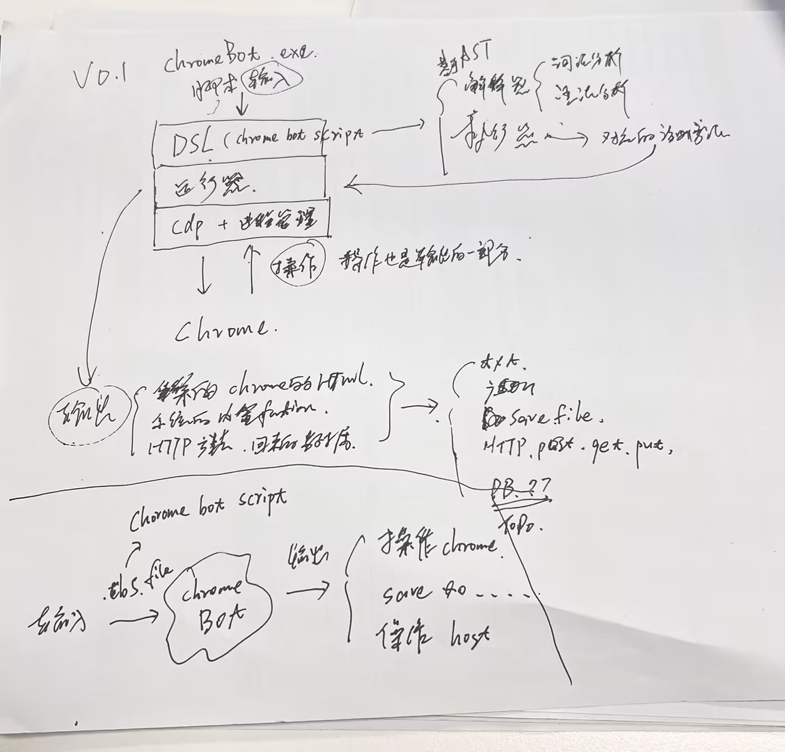
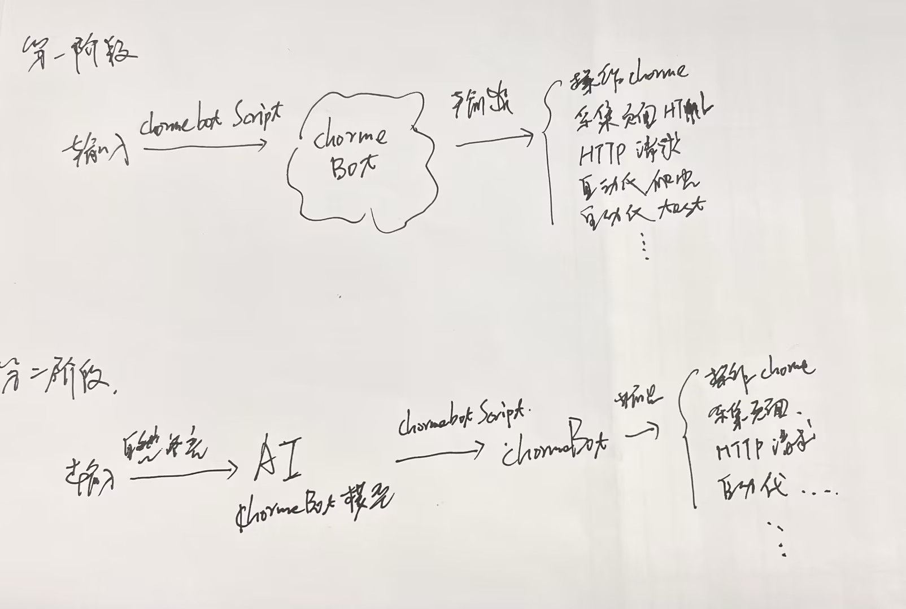

谷歌浏览器（Chrome）自动化平台，通过输入指令或脚本(chrome bot script)自动执行操作Chrome，支持采样输出(页面html,监听Chrome信息等等),与Chrome交互由CDP协议实现


- 最初的想法



- 最终的目标




# ChromeBot Script v0.1
是基于ATS实现是DSL语言，主要用于ChromeBot执行自动化任务的脚本编写，脚本文件后缀为.cbs

## 运行
chromeBot.exe case.cbs

文档 ： [ChromeBot Script 文档](_doc/DSL_v0.1.md)


# 直接运行会进入ChromeBot REPL终端

## 运行

chromeBot.exe

```
_________
|       |
|  o o  |
|   c   |\
|_______| \_chrome

欢迎使用 ChromeBot v0.0.1
https://github.com/mangenotwork/ChromeBot
输入代码并按回车执行，按Ctrl+Z(Windows)退出
使用 'exit' 或 'quit' 命令退出程序
===================================================================
>>> a
a
>>> BayBay.
```

-h 
```

ChromeBot v0.0.1 ( https://github.com/mangenotwork/ChromeBot )

简介：
  谷歌浏览器（Chrome）自动化平台，通过输入指令或脚本(chrome bot script)自动执行操作Chrome

用法：
  chromebot [选项] [文件名]

选项：
  -h    查看 ChromeBot 帮助信息
  -v    查看 ChromeBot 版本信息

示例：
  chromebot          # 启动交互式 REPL 环境
  chromebot test.cbs # 执行 test.cbs 中的代码
  chromebot -v       # 查看版本信息
  chromebot -h       # 查看帮助信息
```

-v
```
v0.0.1
```